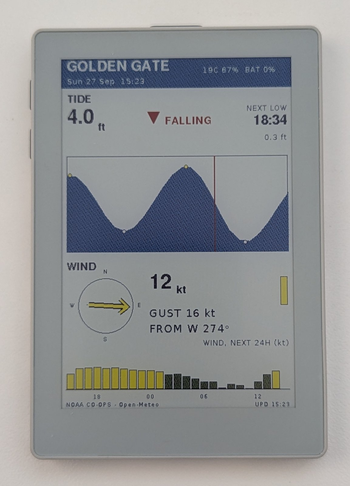
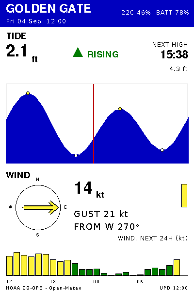

# Tide & Wind Tracker

A battery-powered e-paper dashboard for a coastal spot: current tide level
and trend, the next high/low, today's tide curve, current wind, and a 24-hour
wind forecast. It runs on an M5Stack PaperColor (ESP32-S3, 4" six-color
E Ink Spectra 6 panel). Every 30 minutes it powers up, fetches data over
Wi-Fi from NOAA CO-OPS and Open-Meteo, redraws, and powers itself off
completely until the next wake.





*A render of `test/fixtures/example.json` (synthetic data). This exact
image is the golden that the device's rendered output is tested against.*

## How it works

```
RX8130 RTC alarm -> PM1 powers the board on -> M5.begin() (~50 s)
  -> Wi-Fi + NTP -> NOAA tides/high-lows/water level + observed wind,
     Open-Meteo forecast -> Snapshot
  -> render Snapshot into an off-screen 6-color canvas -> one panel refresh
     (15-30 s)
  -> arm the next RTC alarm -> PM1 cuts power to the whole board
```

- **`src/main.cpp`**: the wake cycle (Wi-Fi, NTP, fetches, sleep). Built
  with `-DTIER1_TEST`, it becomes a test harness that renders fixtures sent
  over USB instead.
- **`src/render.h` / `src/render.cpp`**: the renderer, a pure function of a
  `Snapshot` struct. No Arduino, Wi-Fi or clock dependencies, so the same
  code also builds for the desktop (below).
- **`src/sdl_main.cpp`**: desktop entry point that draws the real renderer
  into an SDL window through M5GFX's SDL backend.
- **`layout.json`**: all pixel geometry. `pio run` generates `src/layout.h`
  from it.
- **`tools/`**: `hil.py` (device test harness), `make_fixture.py` (test
  data), `preview.py` (quick PIL layout mock-up).

Nothing survives in RAM between cycles; the board is fully off. A failed
fetch shows an explicit error state (red or yellow header, `--` values)
rather than stale or zero values, and a Wi-Fi failure shows its reason
(e.g. `NO_AP_FOUND`) on the panel.

## Setup and build

You need:
- An M5Stack PaperColor (SKU C151).
- [PlatformIO Core](https://docs.platformio.org/en/latest/core/installation/index.html)
  (`pio`), or the PlatformIO VS Code extension.
- A **2.4 GHz** Wi-Fi network. The ESP32-S3 has no 5 GHz radio.
- For the host tools (`tools/*.py`) only, a Python 3 with the packages in
  `tools/requirements.txt`:
  - **Windows:** use PlatformIO's own Python,
    `~/.platformio/penv/Scripts/python.exe`, which already has them. A bare
    `python` may be the Microsoft Store stub, which prints "Python was not
    found" and still exits 0 -- so a command can appear to succeed without
    running.
  - **Elsewhere:** `python3` after `pip install -r tools/requirements.txt`.

1. Clone, then create your config from the template (`src/config.h` is
   gitignored):
   ```bash
   git clone https://github.com/GitPell/tide-wind-tracker.git
   cd tide-wind-tracker
   cp src/config.example.h src/config.h
   ```
2. Edit `src/config.h`:
   - `WIFI_SSID`, `WIFI_PASS`: a 2.4 GHz network.
   - `NOAA_STATION`, `STATION_LABEL`: a NOAA CO-OPS station ID and the name
     to show. Find one in the
     [station list](https://api.tidesandcurrents.noaa.gov/mdapi/prod/webapi/stations.json).
     The default is San Francisco (9414290). US stations only.
   - `SITE_LAT`, `SITE_LON`: coordinates for the wind forecast.
   - `TZ_STRING`: your POSIX timezone (the default is US Pacific).
   - Optional: `UPDATE_MINUTES` (default 30; don't go below 15) and
     `FULL_REFRESH_EVERY` (ghost-clearing interval, in cycles).
3. Build the firmware (both device environments):
   ```bash
   pio run
   ```
   The first build downloads the pinned platform, toolchain and Arduino
   framework (several hundred MB) plus the libraries, so expect it to take
   a while. Later builds are much faster.
4. Flash the main firmware and watch the log. Name the environment
   explicitly: `-t upload` without `-e` flashes both environments in turn
   and leaves the *test* firmware on the board.
   ```bash
   pio run -e m5stack-papercolor -t upload --upload-port COM4
   pio device monitor -b 115200 --port COM4
   ```
   Use your board's port (e.g. `/dev/ttyACM0` on Linux). Between cycles the
   board is powered off and its USB port disappears. If upload can't find
   the port, press the power button or wait for the next wake.

### Desktop preview (SDL, Windows)

`pio run -e native` builds the real renderer for the desktop. It assumes
**MSYS2 installed at `C:\msys64`**: `platformio.ini` hard-codes
`C:/msys64/mingw64/include/SDL2` and `C:/msys64/mingw64/lib`, so edit those
two paths if yours differs. Other platforms would need their own SDL2 flags
(untested).

```bash
winget install -e --id MSYS2.MSYS2
# then, in the MSYS2 shell:
pacman -S mingw-w64-x86_64-gcc mingw-w64-x86_64-SDL2
```

Add `C:\msys64\mingw64\bin` to your `PATH` (for `gcc` and `SDL2.dll`) and
open a new terminal. Then:

```bash
pio run -e native              # build
pio run -e native -t upload    # build and run: opens a window showing test/fixtures/example.json
```

Set `SDL_PREVIEW_FIXTURE` to render a different fixture.

## Testing

The render is deterministic: a `Snapshot` in, the same 400x600 six-color
canvas out, byte for byte. Tests compare that canvas, not photos of the
panel (the panel dithers).

- **Fixtures** (`test/fixtures/*.json`) are `Snapshot`s generated by
  `tools/make_fixture.py` from one analytic tide model, never hand-edited.
  There are five normal cases and five failure cases (no Wi-Fi, every fetch
  failed, wind failed, high/low failed, time sync failed).
- **Goldens** (`test/golden/*.png`) are the device's canvas output, reviewed
  and committed on their own. The failure fixtures don't have goldens yet
  (see "Known limitations").
- **On the device:** flash the test firmware
  (`pio run -e m5stack-papercolor-test -t upload --upload-port COM4`), then
  run `~/.platformio/penv/Scripts/python.exe tools/hil.py test --all`
  (Windows; `python3 tools/hil.py ...` elsewhere). Each fixture's round
  trip takes ~230 ms. Exit code 1 means a render differs from its golden; 2 means the
  test couldn't run (board, port, or missing file).
- **On the desktop:** the SDL build produces the *same bytes* as the device.
  Dump the canvas and compare it to a golden, no board needed:
  ```bash
  SDL_PREVIEW_DUMP_RAW=raw.bin pio run -e native -t upload
  ~/.platformio/penv/Scripts/python.exe tools/hil.py decode-raw raw.bin --golden test/golden/example.png
  ```
  (In PowerShell, set `$env:SDL_PREVIEW_DUMP_RAW = "raw.bin"` first.) All
  five original fixtures match their device goldens this way.

## Known limitations

- **Battery life is about half the one-month goal.** A soak test projected
  **~15 days per charge**: the fuel gauge read 100% -> 46% over 8.24 days,
  extrapolated linearly. The gauge's linearity is unverified, so treat this
  as an estimate. *(To be replaced by the measured result of a run-to-empty
  test ending around 2026-10-01.)*
- **The main cause is `M5.begin()`, which takes ~50 s on every wake**, out
  of ~93 s awake. Awake time is ~97% of daily energy use. No configuration
  flag found so far reduces it.
- **TLS uses `setInsecure()`**: HTTPS without certificate verification.
- **The panel doesn't show which wind source is displayed**: NOAA's
  observed reading, or the Open-Meteo forecast it falls back to. There's no
  OBS/FCST label.
- **A full discharge may reset the RTC** (unverified). If the first wake
  after recharging also fails Wi-Fi or time sync, the header shows a wrong
  time without flagging it.
- **Several recent fixes aren't verified on hardware yet**, only by
  reading the code, building, and desktop renders: observed wind, skipping
  the USB wait on battery, Wi-Fi failure diagnostics, time-sync failure
  handling, and the error display. They wait on a post-test checklist
  (in CLAUDE.md) that also captures the failure fixtures' goldens.

## More detail

[CLAUDE.md](CLAUDE.md) is the project's working reference: hardware facts
and pinmap, verified hardware and library gotchas, the battery budget, data
sources, pinned dependency versions, and the test harness in depth.
[DONE.md](DONE.md) defines when the project is finished.

## License

The project's own code is under the MIT License -- see [LICENSE](LICENSE).

The DejaVu fonts in `tools/fonts/` (used by `tools/preview.py`) are not
covered by it. They keep their own license, included as
[tools/fonts/LICENSE](tools/fonts/LICENSE): Bitstream Vera and Arev font
terms, with the DejaVu changes in the public domain.
