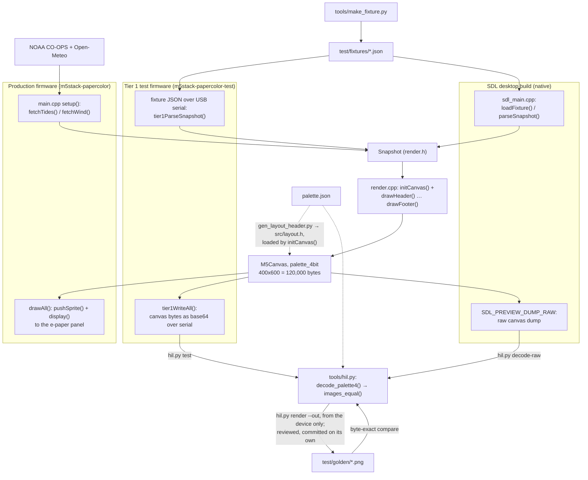

# Letting an AI agent work on firmware it can't see

I built a small tide and wind display: an M5Stack PaperColor, which is an
ESP32-S3 with a 4-inch, six-color E Ink Spectra 6 panel, sitting on a shelf
and showing the tide, the next high or low, today's tide curve, the wind,
and a 24-hour wind forecast. Every 30 minutes it powers on, fetches data from
NOAA and Open-Meteo, redraws, and cuts its own power until the next wake.

The display was the test subject, not the point. What I wanted to find out
was how to let an AI coding agent (Claude Code) iterate on firmware whose
output is a physical e-paper panel it can't see: what hardware-in-the-loop
testing looks like when the one doing the looping has no eyes on the
hardware. This is what worked, what didn't, and what I would do again.

## 1. The problem is verification, not code generation

The agent can write drawing code faster than I can review it. That was never
the constraint. The constraint was that the result of the code is pixels on a
panel that takes 15 to 30 seconds to refresh, has six colors and no
anti-aliasing, dithers whatever you send it, and slowly wears with use. The
agent has no eyes on it. If the only way to check a change is for me to walk
over and look, the loop runs at my speed, and I am the bottleneck.

So the question I started with was not "can the agent write firmware" but
"how does the agent find out whether its change did what it meant, without
me?" Everything below follows from treating that as the actual problem.

## 2. A ladder of checks, with the camera last

The obvious answer is a camera: flash, photograph the panel, compare. I
planned one in detail and then deferred it, because it answers the wrong
question first. I ended up with a three-tier ladder instead:

- **Tier 0, host render (milliseconds).** Draw the layout on the laptop.
- **Tier 1, framebuffer dump (one build and flash of a test firmware, then
  about a quarter of a second per fixture).** The test firmware renders into
  the same off-screen canvas the real firmware uses, then sends the canvas
  bytes back over USB instead of refreshing the panel. The host compares
  them byte for byte against a committed golden image.
- **Tier 2, camera (about a minute).** Proves only that the *panel* did what
  the framebuffer said.

Almost every rendering bug is a wrong coordinate, a font metric, or a color
that snaps to the wrong palette entry. A framebuffer comparison catches those
exactly, pinpoints them to the pixel, and costs no panel wear and no optics.
A camera would spend a minute per iteration rediscovering the same bugs
blurrily. The camera only earns its place for things the framebuffer can't
represent: waveform problems, ghosting, power-rail trouble. I framed it from
the start as a tier I might never need if Tier 1 was good enough.

Tier 1 only works if the output is deterministic, and most of the design work
went into that:

- **Fixtures, not live data.** Tide and wind data change between any two
  renders, so tests draw from JSON `Snapshot` fixtures.
- **Fixtures go in over USB serial, not over Wi-Fi.** That separates
  rendering from fetching. It also meant pixel-exact testing worked long
  before an intermittent Wi-Fi problem was understood.
- **The canvas buffer is the artifact.** A 400x600, 4-bit palette canvas is
  120,000 bytes in PSRAM and is fully deterministic. The panel's own output is
  not: its driver dithers every pixel against its own color table.
- **Zero tolerance.** A render either matches its golden exactly or it
  doesn't. Changing a golden is a separate, reviewed commit with a stated
  reason, and the agent never does it on its own. A golden update asserts
  "this new output is correct", and that is a judgment, not a diff.
- **The render is a pure function of `Snapshot`.** Early on, four draw
  functions each asked the clock for the time, so the header, the next-event
  label, the now-line and the footer could disagree across a minute boundary.
  Sampling the time once into `Snapshot` fixed that and removed the render's
  last dependency on the outside world.
- **Fixtures are generated.** I hand-typed the first fixture's tide samples
  and its high/low events as two arrays. They drifted: two of the four events
  sat 45 to 90 minutes from where the curve actually peaked, and nothing about
  the JSON looked wrong until a render did. Now one analytic tide model
  produces both.

The result is `hil.py test --all`: every fixture in one serial session, about
230 ms each once the test firmware is on the board. That is cheap enough to
run on every render-affecting change: closer to a unit test than to a
hardware session.

## 3. Making Tier 0 exact: one renderer, not two

Tier 0 started as a Python/PIL script that reimplemented the layout. It kept
drifting from the device, starting with font sizes, because it was a second
renderer. Every drift was a small lie about what the panel would show.

So I stopped having two renderers. The drawing code was extracted into a
module with no Arduino, board-library or network dependencies, planned as a
reviewable document first and then carried out and checked against all five
goldens on hardware. The same C++ then compiled for the desktop against the
graphics library's own SDL backend. One wrinkle: Arduino's header still
reached the module through the graphics library on the device build, and
silently replaced a constant I had named `DEG_TO_RAD` with its own macro. The
compiler error pointed at a number where a name should be.

Here is how the pieces fit: one render module, three ways in, and one set of
goldens that both test paths compare against.

The goal was not "the desktop build runs". It was: the desktop build produces
**the same bytes** as the device. The SDL build can dump its canvas, and the
test harness decodes that dump with the same function it uses for the
device's serial dump and compares it with the same golden. Getting to a match
exposed two leaks of the host environment into what should be a pure
function: a station-name fallback that had drifted from the device's parser,
and every timestamp seven hours off, because the goldens were captured on a
device with no timezone configured (UTC) while the desktop used the PC's
Pacific time. After those, the desktop render of the example fixture matched
the device golden exactly. All five original fixtures now match. When I later
pinned dependencies, I moved the desktop build to the device's exact graphics
library commit, so the match holds by construction rather than by luck.

"The preview is the display" turned out to matter more than I expected, for
the reason in the next section.

## 4. What the harness caught, and building a feature with no device

The harness caught what it was designed to catch, but the most useful thing
it caught first was a lie in itself. Early on the harness reported each
framebuffer transfer taking about 10 seconds, and we had half-built a theory
about a hardware throughput ceiling. Then we raised the harness timeout from
10 s to 30 s to 60 s, and the "transfer time" rose with it: 10,230 ms,
30,212 ms, 60,203 ms. A real measurement doesn't move when you change an
unrelated timeout. The host was asking Windows for a fixed 64 KB per read,
and Windows waited out the whole timeout for the last partial read. The real
transfer takes about a quarter of a second. The lesson was to be suspicious
of the tool that produces the numbers, too.

The payoff of an exact desktop renderer came later. For about two weeks near
the end, the device was off-limits: it was running a battery test, and
plugging in USB would have charged it. During that window I built the whole
error display.

Before it existed, a cycle where every fetch failed drew a confident screen:
"0.0 ft" in the largest font, and a green, calm, 0-knot wind from the north.
Every value was a default that looked like a reading. The new design turns
the header red when there is no current data and yellow when some is
missing, replaces missing values with `--`, and puts the Wi-Fi failure
reason (`NO_AP_FOUND` and so on) on the panel.

All of it was built and checked on the desktop:

- The agent wrote the change, generated five new failure fixtures from the
  same generator as the others, and rendered them through the SDL build.
- It proved the five existing fixtures were unaffected by comparing raw
  dumps before and after the change, byte for byte.
- I reviewed the new fixtures as PNGs.

The only step that waits for hardware is capturing the new goldens. A
feature whose whole purpose is what the panel shows was designed, built and
reviewed without the panel.

## 5. Where hardware-in-the-loop stops

The bugs that cost the most were ones no framebuffer can show.

**The hour-late alarm.** A soak test cycled every 89.3 minutes instead of 30.
Before rerunning with a 2-minute interval, I wrote down three predictions:
no bug (about 3 minutes), a multiplicative clock fault (about 10), or a fixed
extra delay (about 61). The rerun landed on the fixed delay. The cause was a
zero-initialized `struct tm`: `tm_isdst = 0` told `mktime()` that the wake
time was standard time, so during daylight time the alarm fired an hour late.
It would never have shown up in a winter test.

The diagnosis had a trap. A diagnostic compared `mktime()`'s result with a
`localtime_r()` round trip, the two agreed, and that seemed to rule
`tm_isdst` out. They agreed because both were correct about an epoch that was
already wrong. Decoding the epoch to UTC by hand settled it.

**The 15-second wait for nobody.** Every boot waited up to 15 seconds for a
USB terminal to connect. With USB attached, which is the only time anyone was
watching the logs, the wait ended instantly. On battery it always ran the
full 15 seconds: about 17 percent of every wake spent waiting for a host that
couldn't exist. It was found by reading the USB serial driver's source, not
by any test.

**Silence on battery.** Without a USB host, serial output is simply dropped.
A Wi-Fi failure in the field leaves no trace in any log, which is why the
failure reason now goes on the panel. The display became its own diagnostic
channel.

**Code nobody could provoke.** After a failed time sync, the firmware wrote
the unsynced clock back into the real-time clock, and that clock reads seven
or eight hours early at that point in the boot. It was found by reading code,
fixed, and is still waiting for a deliberately broken NTP server to confirm
it on hardware.

**The battery itself.** More on that below.

Soak tests became a slow form of hardware-in-the-loop. Careful reading of
library and framework source caught what no test reached.

## 6. The human in the loop

I used two Claudes. Claude in a chat window did architecture, wrote my
prompts, and reviewed the reports and diffs that came back. Claude Code did
all of the work in the repo. I made the decisions and approved every change.

A few habits made this work:

- **CLAUDE.md is the handoff.** Each session starts by reading it and the git
  log and reporting where things stand, without changing anything.
- **Report, then change.** Anything with a design choice ran as two prompts:
  report and propose, stop; implement after approval. The agent shows the
  diff before writing, and never flashes, commits, pushes, updates a golden
  or ticks a checklist box on its own.
- **A definition of done.** Late in the project I asked "what's left?" and
  there was no clear answer, because CLAUDE.md mixed the design with a
  debugging diary. So we wrote `DONE.md`: checkable criteria, plus an
  explicit out-of-scope list. The agent's first audit against it found 19
  open items, three of them already done, and several criteria that were
  ambiguous or wrong. Two of the wrong ones were in the first draft, written
  by the reviewing Claude: one named a file that doesn't exist, and another
  asked for stale data to be shown after a failure. That's impractical
  without adding flash persistence, since the only state the firmware keeps
  across a power cycle is 32 bytes of PMIC RAM.
- **Evidence over assurances.** This one mattered most. I asked for file and
  line citations, raw API responses, byte comparisons and fresh clones,
  rather than summaries.

Asking for evidence is how most mistakes got caught, including the agent's
own:

- **The TLS handshake timeout.** The agent's audit said every HTTP request
  was bounded at 15 seconds. When it later implemented a shorter per-request
  timeout and read the TLS library, it found the handshake had its own
  120-second default, and corrected its earlier audit unprompted.
- **An impossible number.** A 29.2 min/cycle figure was the evidence behind a
  ticked box. It turned out to be impossible: the wake alarm is set 30
  minutes after each cycle ends, at one-minute resolution, so a cycle can't
  come in under 30 minutes. The agent noticed while reading the alarm code
  for something else.
- **A premature battery conclusion.** A three-day soak that only moved the
  gauge from 100% to 98% was read as "the battery lasts about a month". A
  longer soak overturned it.
- **The upload command.** The documented upload command would have flashed
  both firmware builds in turn and left the *test* firmware on the board.
  That was deduced from how the build configuration's default environments
  work, never observed on hardware. The command was in the checklist for the
  day the battery test ends. The agent spotted it while writing the README,
  and a repo-wide search found the checklist copy.
- **Dependency pinning.** Pinning libraries looked done until a fresh
  install showed one library quietly pulling a newer, untested version of
  another through its own dependency list. The agent also traced every byte
  that differed between the pinned and unpinned builds (embedded file paths,
  a hash field and the image trailer) before calling them equivalent.
- **The documentation rewrite.** Restructuring CLAUDE.md from 1,212 to 841
  lines dropped about 20 facts. A mechanical check that extracted all 752
  specific values from the old file (numbers, pins, addresses, hashes,
  function names) caught them before commit.

Not all the mistakes were the agent's; the reviewing Claude and I made our
share. The pattern held regardless of who made the mistake: the ones that
got caught were caught because something had to be shown, not just stated.

## 7. Deferred on purpose

The camera tier was planned in detail. It was a Raspberry Pi HQ camera with a
16 mm lens at f/5.6, about 27 cm from the panel. That was chosen over newer
autofocus modules, because focus drift between runs is exactly what a
comparison can't tolerate. Lighting mattered more than the camera, because
the panel's glossy front layer throws specular highlights. The spend order
was to prove the pipeline with phone photos first and buy hardware last.

Around it sat a Raspberry Pi 5 test rig:
- a dedicated 2.4 GHz access point;
- a mock API server that could inject failures (dropped Wi-Fi, HTTP 500,
  truncated JSON, slow responses);
- over-the-air flashing, overnight soaks, and eventually a CI runner.

And a power profiler, a Nordic PPK2 for about $110, to measure the energy of
a wake and the current in sleep directly.

Tier 1 made most of that optional. Sending fixtures over serial removed the
need for a test access point and mock server just to test rendering. The
camera stayed out of scope, and I still think that was right.

The irony is the power profiler. It was the cheapest item on the list and the
one I deferred most casually. Battery life turned out to be the project's
main open result, and without the profiler I had to measure it indirectly:
soak tests, a percentage gauge whose linearity I can't verify, and
arithmetic. The soaks weren't wasted: the first one is what exposed the
hour-late alarm. But the energy questions, such as how much a wake costs,
how much of it is `M5.begin()`, and what the 15-second serial wait was
burning, a profiler would have answered directly, probably in an afternoon.

## 8. Results and lessons

What exists now:

- A dashboard that has run unattended on battery, fully powered off between
  30-minute wakes.
- A hardware test loop at about 230 ms per fixture with zero tolerance:
  ten fixtures, five of them still waiting for goldens captured on the
  device.
- A desktop renderer that produces the device's exact bytes for all five
  original fixtures.
- A repo that builds from a fresh clone by following the README.

Battery life is **[PLACEHOLDER: update after the run-to-empty, ~2026-10-01]**.
The current projection is about 15 days per charge, half the one-month goal:
the gauge went from 100% to 46% over 8.24 days and 375 cycles. The main cause
is known. The board's library initialization takes about 50 seconds of a
roughly 93-second wake, and awake time is about 97 percent of daily energy.

What I would tell someone trying the same thing:

1. **Make the output deterministic before you try to see it.** A byte-exact
   framebuffer check beat a camera on every bug that mattered for rendering.
2. **Have one renderer.** A second implementation "for previews" is a second
   source of truth that drifts. Compile the real one for the desktop and test
   that it matches.
3. **Keep the device out of the inner loop.** The best feature work happened
   when the device was off-limits, because the loop didn't need it.
4. **Know where the loop ends.** Timing, power, clocks and field failures
   live outside the framebuffer. Soak tests and reading source are the tools
   there, and they are slow, so start them early.
5. **Write down what done means.** It turned an open-ended project into a
   checkable list, and auditing against it found wrong criteria as well as
   missing work.
6. **Ask for evidence, not reassurance.** Citations, raw data, byte
   comparisons, fresh clones. Most of the errors in this project, mine and
   the agent's, were caught the moment something had to be shown.
7. **Buy the measuring instrument for the question you care about.** I
   deferred the one tool that measured the thing that turned out to matter.
